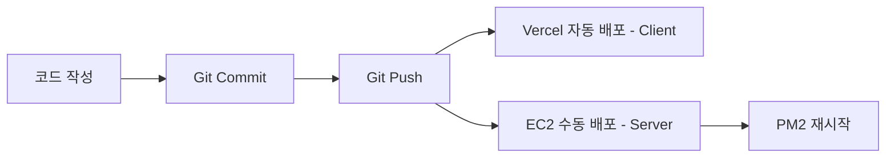

# 배포 가이드

이 프로젝트는 모노레포 구조로 되어 있으며, Client와 Server를 분리해서 배포합니다.

## 📋 목차
- [Client 배포 (Vercel)](#client-배포-vercel)
- [Server 배포 (AWS EC2)](#server-배포-aws-ec2)
- [환경 변수 설정](#환경-변수-설정)
- [Favicon 설정](#favicon-설정)

---

## 🌐 Client 배포 (Vercel)

### 1. Vercel 프로젝트 생성

1. [Vercel](https://vercel.com) 로그인
2. "New Project" 클릭
3. GitHub 저장소 연결

### 2. 프로젝트 설정

**Root Directory 설정:**
```
client
```

**Build & Development Settings:**
- Framework Preset: `Vite`
- Build Command: `npm run build`
- Output Directory: `dist`
- Install Command: `npm install`

### 3. 환경 변수 설정

Vercel 대시보드에서 다음 환경 변수를 추가:

```env
# WebSocket 서버 주소 (EC2 배포 후 업데이트)
VITE_WS_URL=https://your-ec2-domain.com

# Firebase 설정
VITE_FIREBASE_API_KEY=your_api_key
VITE_FIREBASE_AUTH_DOMAIN=your_project.firebaseapp.com
VITE_FIREBASE_PROJECT_ID=your_project_id
VITE_FIREBASE_STORAGE_BUCKET=your_project.appspot.com
VITE_FIREBASE_MESSAGING_SENDER_ID=your_sender_id
VITE_FIREBASE_APP_ID=your_app_id

# Google Analytics (선택사항)
VITE_GA_MEASUREMENT_ID=G-XXXXXXXXXX
```

### 4. 배포

- Git에 푸시하면 자동으로 배포됩니다.
- 또는 Vercel CLI 사용:
  ```bash
  cd client
  npm install -g vercel
  vercel --prod
  ```

---

## 🖥️ Server 배포 (AWS EC2)

### 1. EC2 인스턴스 준비

**권장 사양:**
- Instance Type: `t2.micro` 이상
- OS: Ubuntu 22.04 LTS
- Security Group: Port 3001 (또는 원하는 포트) 오픈

### 2. EC2 접속 및 환경 설정

```bash
# EC2 접속
ssh -i your-key.pem ubuntu@your-ec2-ip

# Node.js 설치 (v18 이상)
curl -fsSL https://deb.nodesource.com/setup_18.x | sudo -E bash -
sudo apt-get install -y nodejs

# PM2 설치 (프로세스 관리)
sudo npm install -g pm2

# Git 설치
sudo apt-get install -y git
```

### 3. 프로젝트 배포

```bash
# 프로젝트 클론
git clone https://github.com/your-username/gganbu.git
cd gganbu/server

# 의존성 설치
npm install

# 환경 변수 설정
cp .env.example .env
nano .env  # 환경 변수 편집
```

### 4. 환경 변수 설정 (.env)

```env
# 서버 포트
PORT=3001

# CORS 허용 Origin (Vercel 도메인)
ALLOWED_ORIGINS=https://your-vercel-app.vercel.app

# LS증권 API (선택사항)
LS_APP_KEY=your_app_key
LS_APP_SECRET=your_app_secret

# 기타 필요한 환경 변수들
```

### 5. PM2로 서버 실행

```bash
# 로그 디렉토리 생성
mkdir -p logs

# PM2로 서버 시작
pm2 start ecosystem.config.js

# PM2 상태 확인
pm2 status

# 로그 확인
pm2 logs gganbu-server

# 서버 재시작
pm2 restart gganbu-server

# 서버 중지
pm2 stop gganbu-server
```

### 6. PM2 자동 시작 설정

EC2 재부팅 시 자동으로 서버가 시작되도록 설정:

```bash
# 현재 PM2 프로세스 저장
pm2 save

# 시스템 부팅 시 PM2 자동 시작
pm2 startup

# 위 명령어가 출력하는 명령어를 복사해서 실행
# 예: sudo env PATH=...
```

### 7. Nginx 설정 (선택사항 - HTTPS 사용 시)

```bash
# Nginx 설치
sudo apt-get install -y nginx

# Nginx 설정 파일 생성
sudo nano /etc/nginx/sites-available/gganbu
```

**Nginx 설정 예시:**
```nginx
server {
    listen 80;
    server_name your-domain.com;

    location / {
        proxy_pass http://localhost:3001;
        proxy_http_version 1.1;
        proxy_set_header Upgrade $http_upgrade;
        proxy_set_header Connection 'upgrade';
        proxy_set_header Host $host;
        proxy_cache_bypass $http_upgrade;
    }
}
```

```bash
# 설정 활성화
sudo ln -s /etc/nginx/sites-available/gganbu /etc/nginx/sites-enabled/
sudo nginx -t
sudo systemctl restart nginx
```

### 8. SSL 인증서 설정 (Let's Encrypt)

```bash
# Certbot 설치
sudo apt-get install -y certbot python3-certbot-nginx

# SSL 인증서 발급
sudo certbot --nginx -d your-domain.com

# 자동 갱신 설정 확인
sudo certbot renew --dry-run
```

### 9. 배포 자동화 (선택사항)

**배포 스크립트 생성:**
```bash
# deploy.sh 파일 생성
nano deploy.sh
```

```bash
#!/bin/bash

echo "🚀 Starting deployment..."

# 최신 코드 가져오기
git pull origin main

# 의존성 업데이트
npm install

# PM2 재시작
pm2 restart gganbu-server

echo "✅ Deployment completed!"
```

```bash
# 실행 권한 부여
chmod +x deploy.sh

# 배포 실행
./deploy.sh
```

---

## 🔐 환경 변수 설정

### Client (.env.local)

```env
# WebSocket 서버 주소
VITE_WS_URL=https://your-ec2-domain.com

# Firebase 설정
VITE_FIREBASE_API_KEY=
VITE_FIREBASE_AUTH_DOMAIN=
VITE_FIREBASE_PROJECT_ID=
VITE_FIREBASE_STORAGE_BUCKET=
VITE_FIREBASE_MESSAGING_SENDER_ID=
VITE_FIREBASE_APP_ID=

# Google Analytics
VITE_GA_MEASUREMENT_ID=
```

### Server (.env)

```env
# 서버 포트
PORT=3001

# CORS 허용 Origin
ALLOWED_ORIGINS=https://your-vercel-app.vercel.app

# LS증권 API
LS_APP_KEY=
LS_APP_SECRET=
```

---

## 🎨 Favicon 설정

Client의 `public` 폴더에 다음 파일들을 추가해야 합니다:

### 필요한 Favicon 파일

```
client/public/
├── favicon.ico          # 16x16, 32x32
├── favicon-16x16.png    # 16x16
├── favicon-32x32.png    # 32x32
├── apple-touch-icon.png # 180x180
└── default.jpg          # 기본 이미지 (이미 존재)
```

### Favicon 생성 방법

1. **온라인 생성기 사용:**
   - [Favicon.io](https://favicon.io/)
   - [RealFaviconGenerator](https://realfavicongenerator.net/)

2. **로고 이미지 준비:**
   - 정사각형 이미지 (최소 512x512px)
   - PNG 형식 권장
   - 투명 배경 가능

3. **파일 생성:**
   - 위 사이트에서 이미지 업로드
   - 다양한 크기의 favicon 자동 생성
   - 다운로드 후 `client/public/` 폴더에 복사

### 현재 설정된 Favicon 태그

[client/index.html](client/index.html)에 이미 설정되어 있습니다:

```html
<link rel="icon" type="image/x-icon" href="/favicon.ico" />
<link rel="icon" type="image/png" sizes="32x32" href="/favicon-32x32.png" />
<link rel="icon" type="image/png" sizes="16x16" href="/favicon-16x16.png" />
<link rel="apple-touch-icon" sizes="180x180" href="/apple-touch-icon.png" />
```

---

## 📊 Google Analytics 설정

### 1. GA4 계정 생성

1. [Google Analytics](https://analytics.google.com/) 접속
2. 계정 생성 또는 기존 계정 선택
3. 속성 만들기 → GA4 속성 생성
4. 측정 ID 복사 (G-XXXXXXXXXX)

### 2. 환경 변수에 추가

**Vercel 환경 변수:**
```env
VITE_GA_MEASUREMENT_ID=G-XXXXXXXXXX
```

### 3. 자동 추적 항목

- 페이지뷰
- 사용자 이벤트 (필요 시 커스텀 이벤트 추가 가능)

---

## 🔄 배포 플로우

### 개발 → 배포



### 업데이트 순서

1. **Server 업데이트:**
   ```bash
   ssh ubuntu@your-ec2-ip
   cd gganbu/server
   git pull
   npm install
   pm2 restart gganbu-server
   ```

2. **Client 업데이트:**
   - Git push만 하면 Vercel이 자동 배포

---

## 🐛 트러블슈팅

### Client 배포 오류

**문제: Build Failed**
```bash
# 로컬에서 빌드 테스트
cd client
npm run build
```

**문제: 환경 변수 인식 안됨**
- Vercel 대시보드에서 환경 변수 확인
- 변수 이름이 `VITE_`로 시작하는지 확인
- 재배포 필요

### Server 배포 오류

**문제: PM2 프로세스가 계속 재시작**
```bash
# 로그 확인
pm2 logs gganbu-server

# .env 파일 확인
cat .env
```

**문제: WebSocket 연결 실패**
- EC2 Security Group에서 포트 확인
- CORS 설정 확인 (.env의 ALLOWED_ORIGINS)
- Client의 VITE_WS_URL 확인

**문제: 포트 충돌**
```bash
# 포트 사용 확인
sudo lsof -i :3001

# 프로세스 종료
sudo kill -9 <PID>
```

---

## 📝 체크리스트

### 배포 전 확인사항

- [ ] Firebase 프로젝트 생성 및 설정 완료
- [ ] Google Analytics 계정 생성 (선택사항)
- [ ] Favicon 파일 준비 및 추가
- [ ] EC2 인스턴스 생성 및 보안 그룹 설정
- [ ] 도메인 준비 (선택사항)

### Client 배포 체크리스트

- [ ] Vercel 프로젝트 생성
- [ ] Root Directory를 `client`로 설정
- [ ] 환경 변수 설정 (Firebase, WS_URL, GA)
- [ ] 배포 성공 확인
- [ ] 실제 사이트 접속 테스트

### Server 배포 체크리스트

- [ ] EC2 인스턴스 접속
- [ ] Node.js, PM2 설치
- [ ] 프로젝트 클론
- [ ] .env 파일 설정
- [ ] PM2로 서버 실행
- [ ] PM2 자동 시작 설정
- [ ] 로그 확인
- [ ] WebSocket 연결 테스트

### 통합 테스트

- [ ] Client에서 Server WebSocket 연결 확인
- [ ] 실시간 주식 데이터 수신 확인
- [ ] Firebase 채팅 기능 확인
- [ ] Google Analytics 데이터 수집 확인

---

## 🔗 유용한 링크

- [Vercel Documentation](https://vercel.com/docs)
- [PM2 Documentation](https://pm2.keymetrics.io/)
- [Firebase Console](https://console.firebase.google.com/)
- [Google Analytics](https://analytics.google.com/)
- [Let's Encrypt](https://letsencrypt.org/)

---

## 📞 문제 해결

문제가 발생하면:
1. 로그를 먼저 확인 (PM2 logs, Vercel logs)
2. 환경 변수 설정 재확인
3. 네트워크 연결 확인 (CORS, Security Group)
4. 서버 재시작 시도

---

**마지막 업데이트:** 2024-03-04
